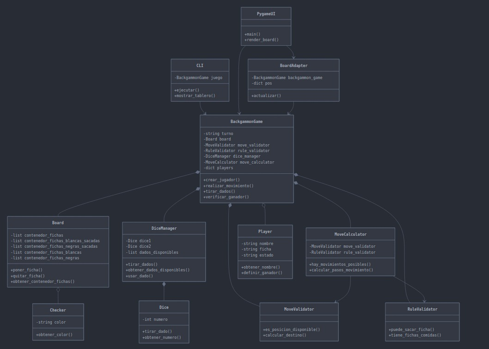

# Diseño General

El diseño del proyecto consiste en la parte principal del proyecto, que es el directorio core, donde se encuentra la logica de central del juego Backgammon. Para interactuar con el juego está la línea de comando (CLI) para jugar a traveź de la terminal y la otra forma de interactuar con el juego es atravez de gráficos con Pygame.

El el proyecto se encuentra el directorio test, donde están los test de cada una de las calses del proyecto incluyecdo el CLI, la covertura del código se realizó con pruebas unitarias

# Clases Elegidas

## Checker

Representa un ficha del tablero, tiene un unico atributo que es color, y sirve para identificar si la ficha es color o negro, al crear una instacia de Checker recibe el parametro el color correspondiente y tiene un metodo obtener_color() que retorna el atributo color de la ficha

## Dice

Representa un dado del tablero, su atributo es numero y esta clase utiliza random para definir el su numero correspondiente, es la clase responsable del dado y su valor

## Player

Es la clase utilizada para cada jugador, sus atributos son nombre, estado y ficha. El atributo ficha es color de la ficha correspondiente al jugador y el atributo estado define si el jugador está jugando, ganó o empató, (es una idea que saqué del trabajo práctico ta te ti). La responsabilidad de la clase es mantener la información de los jugadores del juego como la su color correspondiente en el juego (blanco o negro y su estado)

## Board

Esta clase define el tablero del juego. Es la que mantiene información de la posición de cada una de las fichas en el tablero, también tiene información de las fichas capturadas y de las fichas ya sacadas del tablero, esta clase es la que quita la fichas de una posición especioca y pone la ficha en otra posición especifica, valida si un jugador ganó, sabiendo si se quitaron las 15 fichas del tablero.

Los atributos de board son:

- conetenedor_fichas: es una lista de 24 listas, que cada una de estas 24 listas representa una posición en el tablero, es el atributo encargado de almacenar las fichas que están en el tablero

- conetenedor_fichas_blancas_sacadas: es la lista que contiene las fichas blancas que ya han sido sacadas del tablero, si la cantidad de fichas en esta lista es de 15 gana el jugador de ficahs blancas

- conetenedor_fichas_negras_sacadas: es la lista que contiene las fichas negras que ya han sido sacadas del tablero, si la cantidad de fichas en esta lista es de 15 gana el jugador de ficahs negras

- conetenedor_fichas_blancas: es la lista que contiene las fichas blancas capturadas, es decir las fichas que se han capturado en el turno del oponente, si hay alguna ficha en esta lista, entonces la posisción inicial es el inicio

- conetenedor_fichas_blancas: es la lista que contiene las fichas negras capturadas, es decir las fichas que se han capturado en el turno del oponente, si hay alguna ficha en esta lista, entonces la posisción inicial es el inicio

La reponsabilidad de Board es el estado de las fichas en juego 

## MoveValidator

Es la clase encargada de validar si un movimiento es legal, es decir que si el movimiento que se quiere realiazr es posible segun las reglas básicas, por ejemplo si el moviemito conicide con algun dado, si la posición no está ocupada por más de una ficha del oponente o acumular fichas en una posición. Por lo tanto su reonsabilidad es verifica si una posición está disponible para colocar una ficha

## RuleValidator

Es la clase encargada verificar las reglas especiales como sacar fichas del tablero y verificar (a travez de la clase tablero), lo que hcae ára verificar si se puede sacar una ficha segun el turno, todas las fichas deben estar en el home board (útimo cuadrante), El dado debe coincidir EXACTAMENTE con la distancia necesaria para sacar la ficha y Si el dado es MAYOR y NO hay fichas más atrás, se puede sacar. Entonces su reponsabilidad es vlidar reglas especiales del Backgammon

## DiceManager

Es la clase cuya reponsabilidad es gestionar los dados del juego, por lo tanto es la clase que sabe sobre los dados disponibles, puede utilizar dado para consumir un dado dsiponible, puede tirrar los dados para definir su valor y saber si se duplixan o nó, retorna información sobre los dados dsiponiles.

Sus atribtos son:
- dice_1: es una instacia de la clase Dice, es uno de los dados que gestionará DiceManager
- dice_2: es la otra instacia de la clase Dice, es el otro dado que gestionará DiceManager
- dados_dispnibles: es una lista que almacena los dados disponibles del juego, a medida que se realizan movimientos, se van consumiendo los dados de esta lista y una vez esté vacia se cambiará de turno para que cuando se vuelvan a tirar los dados, se vuelvan a ingresar los dados a esta lista

## MoveCalcualtor

Es la clase cuya responsabilidad es de calcular los movientos posibles, calcula si hay movimientos posibles desde inicio (ficha capturada) o si hay moviemitos normales posibles, tabién calcula distancioa entre dos posiciones, retorna True si hay al menos un movimiento posible.

Sus atributos son:

- move_validator: utiliza la clase MoveValidator para verifciar en cada una de las posicioens ocupadas por fichas correspoendientes al turno si se puede realizar algún movimiento con los dados disponibles

- rule_validator: utilzia la clase RuleValidator para verificar alguno de los movimientos posibles es quitar una ficha del tablero

## Clase BackgammonGame

Es la clase encargada de orquetrar el juego Backgammon, utilizando a todas las clases anteriores. Se encarga de realizar los moviemtos del juego pasando por las validaciones necesarias, utiliza la información de los dados y del tablero para relizar los moviemitos y gestionar en turno de cada jugador, contiene las validacioens de para ganar o perder.

Sus atributos son:

- turno: string que representa el turno actual del juego, cambiará cuando no hallan movimientos posibles o no hallan dados disponibles

- board: utiliza la clase board para obtener la información del estado de las fichas en juego y realizar los movimientos

- move_validator: utiliza esta clase paar la función verificar_posición_disponible

- dice_managar: backgammongame utiliza esta clase para las operaciones que involucran los dados, como consumir un dado para mover una ficha, verificar si se puede sacar una ficha, verificar si se el movimiento que se quiere realizar coincide con algún dado o cambiar de turno

- move_calculator: esta clase es utilizada en la función verificar_movimientos_posibles que es la función que cambiará de turno si noy hay movientos posibles

- players: es un diccicionario que almacena a las instancias de jugador y sus indices son su color de ficha correspondiete (idea que saqué del ta te ti)

## Clase BoardAdapter

Es una clase que utilizo en pyagme para traducir el formato de la información de las fichas en cada posición del tablero, es decir que combierte la estructura de Checkers a tuplas, para que sea compatible con el formato de pygame propuesto en Slack.

Convierte: [Checker, Checker, ...] → ('white'/'black', cantidad)

Sus atributos son:

- backgammongame: para obtener la información de las fichas en juego para conocer la información de las posicones de las fichas en tablero del juego

- pos: es un diccionerio donde los indices es el numero que indetifica a una posición en tablero se guardan las tuplas en formato ('white'/'black', cantidad)

- actualizar: la función que se encarga de traducir los distintos formatos 

# Decisiones de Diseño generales

En un principio las clases DiceManager, MoveValidator, MoveCalculator y RuleValidator no exitían, todas esas responsabilidades las las tenía BackgammonGame, y para que se cumplan los principios SOLID dividí las reponsabilidades en esas clases.

También por cada commit se ha hecho actualizado el archivo CHANGELOG.md.

Los reportes del coverage y el pylint se generan automáticamente en una rama llamda automated-reports-update, en dicha ramma hay un archivo REPORTS.md donde se encuentran los reportes, y agregado promnts enviados a la IA utilizados para el desarrollo del proyecto

Para el puntaje del pylint, incluí a los directorios core, cli y pygame_ui. En un principio, antes de incluir al pygame tenpia un puntaje superior a 9 con el core y cli, pero despues de incluirlo ha bajado mucho el puntaje (8,5), y no he podido mejorarlo

Se han incluido los archivos de test en .coveragerc para coverage los ignore

# Excepcioenes y manejo de errores

En la clase backgamongame, se han definido las siguientes excepciones:

- NoHayMovimientosPosibles: Excepción lanzada cuando no hay movimientos posibles.

- MovimientoInvalido: Excepción lanzada cuando el movimiento que se quiere realizar es inválido.

- Ganador: Excepción lanzada cuando hay un ganador(idea sacada de ta te ti). 

- NombreVacio: Excepción lanzada cuando el nombre ingresado está vacio.

- NoSeIngresoEnteroError: Excepción lanzada cuando el nombre ingresado está vacio (idea sacada de ta te ti).

# Estrategias de testing y covertura

Hay un archivo de test para cada clase del proyecto, donde se testean las funciones de dicha clase y que resultados generará segun el escenario especifico del test, para funciones donde se necesiten valores espeficos del dados se ha usado mock_randint para que el valor random obtenido al tirar los dados sea un especifico necesario para correcto funcionamiento del test. Para los test del CLI se ha usado mock_input para manejar los inputs del CLI, mock_print para verificar ciertos prints y evitar que la consola se llene de prints y @patch.object(CLI, 'mostrar_tablero') para Evitar renderizar gráficos durante tests (más rápido), Verificar que se llamó al método y Aislar la lógica de negocio de la interfaz.
Se ha buscado que la covertura de los test supere el 90%

# Referencias a requisitos SOLID y como se cumplen

## SRP
 - Board: Solo gestiona el tablero y las fichas
 - MoveValidator: Solo valida movimientos básicos
 - RuleValidator: Solo valida reglas especiales
 - DiceManager: Solo gestiona dados
 - MoveCalculator: Solo calcula movimientos posibles
 - Player: Solo representa jugadores
 - Checker: Solo representa fichas
 - Dice: Solo representa un dado
 - BackGammongame: Orquestrar el juego Backgammon

 ## Open/Closed Principle
 - Se puede extender funcionalidad sin modificar clases existentes
 -  Por ejemplo, se prodrían agregar nuevos validadores sin cambiar los existentes

 ## Liskov Substitution Principle
- No hay herencia problemática en tu proyecto
- Las clases son independientes y no hay violaciones

## Interface Segregation Principle
-  Cada clase expone solo los métodos necesarios
- BackgammonGame actúa como fachada coordinando servicios específicos

## Dependency Inversion Principle
- BackgammonGame inyecta dependencias en el constructor

## Anexo: Diagrama de Clases

